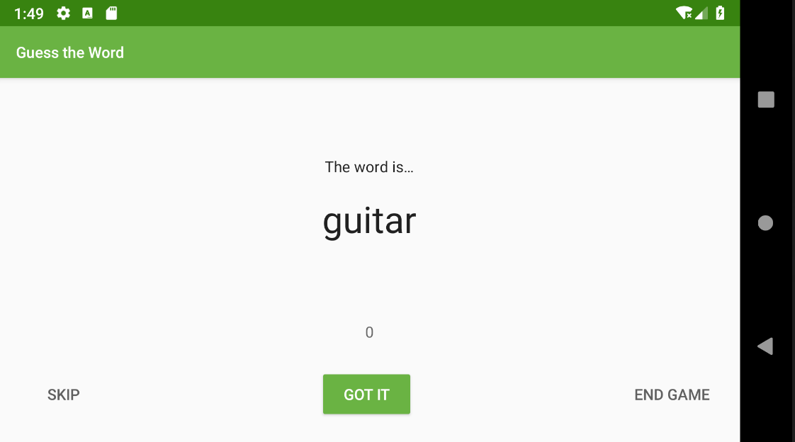

# Badge 6-4. LiveData Transformations

# 1. Introduce GuessTheWord Sample App.

GuessTheWord 앱은 두 명의 사용자가 게임을 하는데, 첫 번째 플레이어는 앱에서 표시하는 단어를 보고 행동을 취합니다. 두 번째 플레이어는  앱에 표시되어 있는 단어를 보지 않고, 첫 번째 플레이어의 행동을 보고 단어를 유츄합니다. 



맞췄으면 Got It 버튼, 못 맞추면 Skip, 종료하려면 END GAME을 눌러 게임을 진행합니다. 

게임시간은 1분이며 앱에서 카운트가 제공됩니다. 

# 2. Task: 타이머 추가

1. GameViewModel 에서 타이머 상수를 담을 객체를 생성합니다.

```kotlin
companion object {

   // Time when the game is over
   private const val DONE = 0L

   // Countdown time interval
   private const val ONE_SECOND = 1000L

   // Total time for the game
   private const val COUNTDOWN_TIME = 60000L

}
```

2. 타이머의 카운트 다운 시간을 저장할  _currentTime 멤버변수와                                     currentTime backing properties를 선언합니다. 

```kotlin
// Countdown time
private val _currentTime = MutableLiveData<Long>()
val currentTime: LiveData<Long>
   get() = _currentTime
```

3. private timer 멤버변수를 추가하고, init 블록내에서 타이머를 초기화하고 시작합니다. 

- 총시간 : COUNTDOWN_TIME
- 시간 간격 : ONE_SECOND
- 

```kotlin
private val timer: CountDownTimer

init{
	timer = object : CountDownTimer(COUNTDOWN_TIME, ONE_SECOND) {
	
	   override fun onTick(millisUntilFinished: Long) {
				// Save current countdown
	       _currentTime.value = millisUntilFinished/ONE_SECOND
	   }
	
	   override fun onFinish() {
				// If countdown is finished, stop the game.
	       _currentTime.value = DONE
			   onGameFinish()
	   }
	}
	
	timer.start()
}
```

4. nextWord()에서는 게임을 끝내는 대신 문제를 리셋하도록 하겠습니다. 

```kotlin
/**
 * Moves to the next _word in the list.
 */
private fun nextWord() {
    if (wordList.isEmpty()) {
        //onGameFinish()
        resetList()

    } else {
        //Select and remove a _word from the list
        _word.value = wordList.removeAt(0)
    }
}
```

5. onCleared() 에서는 타이머를 취소하여 메모리 누수를 방지합니다. 

```kotlin
/**
 * Callback called when the ViewModel is destroyed
 */
override fun onCleared() {
    super.onCleared()
    timer.cancel()
    Log.i("GameViewModel", "GameViewModel destroyed!")
}
```

# 3. Task: Add transformation for the LiveData

자, 게임 기능은 다 만들었는데, 표시해줄 카운팅 문자열 데이터와 실제 표시해줄 레이아웃이 없죠?! 

문자열 데이터를 "MM:SS" 형식의 LiveData로 Transformations.map() 메서드를 통해 LiveData 를 계산하고 문자열을 반환해봅시다. 

1. GameViewModel 클래스에서 currentTime  을 이용해서, currentTimeString 이라는 LiveData를 만들어봅니다. 
2. Transformations.map() 은 당연하게도 들어가는데, currentTime 을 시간 포멧으로 변경합니다. 

```kotlin
// The String version of the current time
val currentTimeString = Transformations.map(currentTime) { time ->
   DateUtils.formatElapsedTime(time)
}
```

3. game_fragment.xml 파일에서 데이터 바인딩으로 연결해주면 끄읕!

```xml
<TextView
    android:id="@+id/timer_text"
    android:layout_width="wrap_content"
    android:layout_height="wrap_content"
    android:layout_marginStart="8dp"
    android:layout_marginEnd="8dp"
    android:layout_marginBottom="8dp"
    android:fontFamily="sans-serif"
    android:textColor="@color/grey_text_color"
    android:textSize="14sp"
    android:textStyle="normal"
    app:layout_constraintBottom_toTopOf="@+id/score_text"
    app:layout_constraintEnd_toEndOf="parent"
    app:layout_constraintStart_toStartOf="parent"
    **android:text="@{gameViewModel.currentTimeString}"**
    tools:text="0:00" />
```

4. 결과!


# 4. 엥? 이게 왜 돼?!

참고 : [liveData 변형하기](https://wooooooak.github.io/android/2019/07/13/liveData%EB%B3%80%ED%98%95%ED%95%98%EA%B8%B0/)

CountDownTimer 에서 currentTime이 변경될 때마다 Transformations.map으로 전달받은 currentTimeString 도 알아서 변경된다! 처음 한번만 되는 것도 아니고 계속해서 화면에 카운트다운이 표시된다. 어떻게 된 일일까?!

1. Transformations.map

Transformations.map 은 내부적으로 MediatorLiveData 를 사용하고 있기 때문이다. 이 객체를 간단히 설명하자면 Rx의 merge 함수와 비슷하다. 서로 다른 data source가 독립적으로 전재하는 상황에서, 각각의 데이터 소스들이 변경 되는 것을 따로따로 관찰하는 것이 아니라 어떤 소스에서 변경이 일어나든 한번에 관찰하려고 하는 것이다. 내부 구현은 다음과 같다. 

```kotlin
@MainThread
@NonNull
public static <X, Y> LiveData<Y> map(
        @NonNull LiveData<X> source,
        @NonNull final Function<X, Y> mapFunction) {
    final MediatorLiveData<Y> result = new MediatorLiveData<>();
    result.addSource(source, new Observer<X>() {
        @Override
        public void onChanged(@Nullable X x) {
            result.setValue(mapFunction.apply(x));
        }
    });
    return result;
}
```

2. Transformations.switchmap

Transformations는 switchmap 함수도 제공한다. 


map 함수와 다른 점은 딱 하나! 함수에서 LiveData 값을 반환시켜야 한다는 것이다. 그래서 실제로 Room이나 Model 단에서 애초에 LiveData를 반환하는 기능들과 자주 함께 쓰인다. 

```kotlin
val userIdLiveData: MutableLiveData<Int> = MutableLiveData<Int>().apply { value = 1 };
 val userLiveData: LiveData<User> = Transformations.switchMap(userIdLiveData) { id ->
     repository.getUserById(id)
 }

 fun setUserId(userId: Int) {
      userIdLiveData.setValue(userId);
 
```

# Question

1. In which class should you add the data-formatting logic that uses the Transformations.map() method to convert LiveData to a different value or format? LiveData 로 데이터를 변형시키는 map을 어디서 써야할까?
- **`ViewModel`**
- **`Fragment`**
- **`Activity`**
- **`MainActivity`**

- 정답

    쓸려면 다 쓸수 있고, 아키텍쳐를 지키자면 ViewModel에서 사용!

2. The Transformations.map() method provides an easy way to perform data manipulations on the LiveData and returns __________ .  map은 수행결과로 어떤 것을 반환할까?

- A **`ViewModel`** object
- A **`LiveData`** object
- A formatted **`String`**
- A **`RoomDatabase`** object

- 정답

    A **`LiveData`** object

3. What are the parameters for the Transformations.map() method? map의 매개변수는 뭐야?

- A source **`LiveData`** and a function to be applied to the **`LiveData`**
- Only a source **`LiveData`**
- No parameters
- **`ViewModel`** and a function to be applied

- 정답

    A source **`LiveData`** and a function to be applied to the **`LiveData`**

4. The lambda function passed into the Transformations.map() method is executed in which thread?

- Main thread
- Background thread
- UI thread
- In a coroutine

- 정답

    Main thread = UI thread